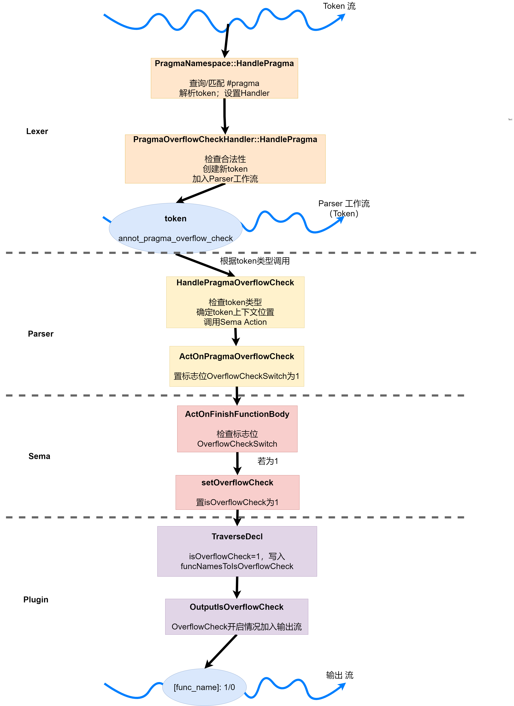

[TOC]
# 编译原理研讨课实验PR001实验报告

## 任务说明

### 一、熟悉实验环境

了解llvm框架的整体构成，熟悉Clang的编译、安装与使用流程

- 需要掌握从源代码编译安装LLVM和Clang
- 需要了解如何生成和查看C程序对应的AST
- 要求正确编译生成Clang和LLVM的可执行文件，并可以查看一个C程序对应的AST

### 二、overflow check制导

在前端添加overflow check操作的制导，使编译器能够正常识别`#pragma overflowCheck`。

- 对于添加了制导的源程序 *.c ，按照规则在编译时打印每个函数的名称，该函数是否在制导范围内。
  - 一个制导总是匹配在其后出现的，离它最近的一个函数定义
  - 一个制导只能匹配最多一个函数定义

## 成员组成

- 刘泽昊 2019K8009915026
- 马月骁 2019K8009915025
- 蔺星玥 2019K8009922017

## 实验设计

### 设计思路  
整体设计流程图如下：

由上图可见，本次实验大致可分为4个部分：

* #### 1. `Lexer`：识别、处理Token
  （1）`Lexer`调用`PragmaNamespace::HandlePragma`在Token流中正确识别、解析`#pragma`；

  （2）`Lexer`调用`PragmaOverflowCheckHandler::HandlePragma`将`#pragma`替换为注释Token，便于后续`Parser`处理。

* #### 2. `Parser`：传递Token信息至语义处理
  `Parser`调用`Parser::HandlePragmaOverflowCheck`确定Token类型、位置后，将Token信息传递给`Sema`。若Token为`annot_pragma_overflow_check`，则需要将`Sema`的`OverflowCheckSwitch`域置1（表示开启overflowCheck）。

* #### 3. `Sema`：根据制导处理函数定义
  每种声明在程序中存在一些声明的上下文，如翻译单元，名称空间，`class` ，`function`，这些声明上下文在clang中被定义为`DeclContext` 类，包括(`TranslationUnitDecl`,` NamespaceDecl`,` RecordDecl`,` FunctionDecl`) 本次实验的`#pragma OverflowCheck`所需要的上下文为`FunctionDecl`(FD), `DeclContext`提供包括存储声明，查找声明，声明所有权查找等功能

  `Sema`调用`Sema::ActOnFinishFunctionBody`，若`OverflowCheckSwitch`域为1，则将紧邻`FD`域中的`IsOverflowCheck`置1。
  
* #### 4. `Plugin`：输出（插件）
  `Plugin`调用`TraverseDecl`、`OutputOverflowCheck`将`#pragma overflowCheck`工作情况打印。


### 实验实现

#### 一、Lexer语法分析器

##### 1、`HandlePragma`函数

当Lexer处理到`#pragma`的时候，将调用`HandlePragma`函数来处理相关的token。要处理的Pragma种类记录在Token中，以参数的形式传递给该函数。

`HandlePragma`函数定义在`Pragma.cpp`中。

```c++
void PragmaNamespace::HandlePragma(Preprocessor &PP, 
                                   PragmaIntroducerKind Introducer,
                                   Token &Tok) {
  PP.LexUnexpandedToken(Tok);
  PragmaHandler *Handler
    = FindHandler(Tok.getIdentifierInfo() ? Tok.getIdentifierInfo()->getName()
                                          : StringRef(),
                  /*IgnoreNull=*/false);
  if (Handler == 0) {
    PP.Diag(Tok, diag::warn_pragma_ignored);
    return;
  }
  Handler->HandlePragma(PP, Introducer, Tok);
}
```

在处理时Lexer会根据Token内的信息，通过调用`FindHandler`函数寻找其对应的Handler，并对Handler进行调用，来完成进一步的处理流程。在本次实验中，我们需要实现`PragmaOverflowCheckHandler`类，用来处理`#pragma overflowCheck`。

##### 2、定义`PragmaOverflowCheckHandler`类

`PragmaOverflowCheckHandler`类定义在`ParsePragma.h`中。

可以仿照`PragmaAlignHandler`类的写法，对`PragmaOverflowCheckHandler`类进行改写，`PragmaOverflowCheckHandler`类继承其父类`PragmaHandler`，并需要对父类的方法`HandlePragama`进行重写。

```c++
class PragmaOverflowCheckHandler : public PragmaHandler {
public:
  explicit PragmaOverflowCheckHandler() : PragmaHandler("overflowCheck") {}

  virtual void HandlePragma(Preprocessor &PP, PragmaIntroducerKind Introducer,
                            Token &FirstToken);
};
```

##### 3、实现`PragmaOverflowCheckHandler::HandlePragma`函数

`HandlePragma`函数定义在`ParsePragma.cpp`中。

* 判断是否是合法的Overflow的Pragma，按照要求，合法的制导为`#pragma overflowCheck `。
* 如果合法，生成一个新的Token，并在该Token的注释token复用字段中填入相应的语义信息，包括`Kind`（`annot_pragma_overflow_check`）、`Location`、`AnnotationValue`。
* 通过调用`EnterTokenStream`函数将这个Token塞入到编译器处理的Token流之中。

```c++
void PragmaOverflowCheckHandler::HandlePragma(Preprocessor &PP, 
                                              PragmaIntroducerKind Introducer,
                                              Token &OverflowCheckTok){
  //ParseOverflowCheckPragma(PP,OverflowCheckTok);
  PP.CheckEndOfDirective("pragma overflowCheck");
  Token *Toks =
    (Token*) PP.getPreprocessorAllocator().Allocate(
      sizeof(Token) * 1, llvm::alignOf<Token>());
  new (Toks) Token();
  Toks[0].startToken();
  Toks[0].setKind(tok::annot_pragma_overflow_check);
  Toks[0].setLocation(OverflowCheckTok.getLocation());
  Toks[0].setAnnotationValue(NULL);
  PP.EnterTokenStream(Toks, 1, /*DisableMacroExpansion=*/true,
                      /*OwnsTokens=*/false);  
}
```
* 值得注意的是，此时新建的Token（`annot_pragma_overflow_check`）为注释标记，在塞入`Parser`的Token流时，将会替换原有Token。这使得`Parser`在回溯时，不需要重做语义分析，来确定一个Token序列是一个变量类型，模板等。
* 注释Token的有效字段与普通Token不同，但它们被多路复用到普通Token中，其中的语义信息包括
  * `SourceLocation “Location”` 标记第一个被替换的token
  * `SourceLocation “AnnotationEndLoc”` 标记最后一个被替换掉token
  * `void* “AnnotationValue”`  这包含parser从中获取的`Sema`对象，parser仅保留信息，以供`Sema`以后根据注释标记类型进行解析
  * `TokenKind “Kind"` 表示token种类
    * ` tok::annot_typename` 表示一个已解析的类型名标记，本次实验中为`tok::annot_pragma_overflow_check`
    * `tok::annot_cxxscope` 表示一个c++范围说明符
    *  `tok::annot_template_id` 标记C++模板ID

#### 二、Parser语法分析器


在`Parser::ParseExternalDeclaration`（前端的核心调用之一）的`switch-case`中需要添加新`case`：`tok::annot_pragma_overflow_check`，从而实现`Parser::HandlePragmaOverflowCheck`的调用。

##### 1、实现`Parser::HandlePragmaOverflowCheck`函数

`HandlePragmaOverflowCheck()`函数定义在`ParsePragma.cpp`中，功能是将token信息传递给Sema。

- 检查token种类
- 通过调用`ConsumeToken()`函数定位token的位置。
- 调用`ActOnPragmaOverflowCheck`将信息传递给Sema。
- `Sema::ActOnPragmaOverflowCheck`会将Sema的标志位`OverflowCheckSwitch`置1。

```c++
void Parser::HandlePragmaOverflowCheck() {
    assert(Tok.is(tok::annot_pragma_overflow_check));
    SourceLocation PragmaLoc = ConsumeToken();
    Actions.ActOnPragmaOverflowCheck();
}
```

#### 三、Sema语义分析器

##### 1、实现`Sema::ActOnFinishFunctionBody`函数

`Sema::ActOnFinishFunctionBody`函数定义在SemaDecl.cpp中，这一函数功能是将`OverflowCheck`信息传递到`FunctionDecl`类中。

- 检查`OverflowCheckSwitch`标记，若为1，调用`setOverflowCheck`函数`IsOverflowCheck`置1，否则置0，将信息传递给`FunctionDecl`类。
- `IsOverflowCheck`定义在`FunctionDecl`类中，表示该函数是否开启OverflowCheck检查。
- `setOverflowCheck`函数是`FunctionDecl`类中的方法，用于设置`IsOverflowCheck`。

```c++
Decl *Sema::ActOnFinishFunctionBody(Decl *dcl, Stmt *Body,
                                    bool IsInstantiation) {
  FunctionDecl *FD = 0;
  FunctionTemplateDecl *FunTmpl = dyn_cast_or_null<FunctionTemplateDecl>(dcl);
  if (FunTmpl)
    FD = FunTmpl->getTemplatedDecl();
  else
    FD = dyn_cast_or_null<FunctionDecl>(dcl);
...

  if (FD) {
    FD->setBody(Body);

    if(OverflowCheckSwitch == 1){
      FD->setOverflowCheck(true);
      OverflowCheckSwitch = 0;
    }
    else{
      FD->setOverflowCheck(false);
    }
    ...
  }
  ...
}
```

#### 四、 在输出插件中添加打印语句，用于验证前端是否正常工作

##### 1、修改`TraverseDecl`函数

`TraverseDecl`函数定义在`TraverseFunctionDecls.cpp`中，本次实验我们需要添加的功能是检查`IsOverflowCheck`标志的值，将结果写进`funcNamesToIsOverflowCheck[]`。

```c++
bool TraverseDecl(Decl *DeclNode) {
...
            bool IsOverflowCheck = FD -> isOverflowCheck();

            if(IsOverflowCheck) {
                funcNamesToIsOverflowCheck[name] = true;
            } else {
				std::map<std::string, unsigned>::iterator it = funcNamesToIsOverflowCheck.find(name);
				if(it == funcNamesToIsOverflowCheck.end())
					funcNamesToIsOverflowCheck[FD->getNameAsString()] = FD -> isOverflowCheck();
            }

        }
        return RecursiveASTVisitor<TraverseFunctionDeclsVisitor>::TraverseDecl(DeclNode);
    }
```

##### 2、实现`OutputOverflowCheck`函数

`OutputOverflowCheck`函数定义在`TraverseFunctionDecls.cpp`中，功能是遍历`funcNamesToIsOverflowCheck`，将每个函数的OverflowCheck开启情况塞入输出流。

```c++
void OutputOverflowCheck() {
        for(std::map<std::string, unsigned>::iterator it = funcNamesToIsOverflowCheck.begin(); it != funcNamesToIsOverflowCheck.end(); ++it) {
            llvm::outs() << it -> first << ": " << it -> second << "\n";
        }
    }

```

## 总结

### 实验结果总结
#### 一、AST
```
int f(int x){
	int result = (x/42);
	return result;
}
```

对上述简单的`test.c`程序运行`clang` 将`AST` dump至终端结果如下图所示。


输出的抽象语法树信息中，每一行代表一个`AST node`（包括类型，行号，列好以及类型信息等）通过缩进表示语法树结构.

`TranslationUnitDecl`为一类特殊的`DeclContext`，将整个文件视作一个翻译单元，可以理解成全局环境.

在全局环境中，包括一系列全局变量，全局类型，由于本次代码简单，不包括全局变量，包括三种`TypedefDecl`全局类型，以及一个`FunctionDecl`C语言方法定义`f 'int(int)'.`

其中`f`函数包含一个`ParmVarDecl`参数定义 `x 'int'`，以及一个`CompoundStmt`复合多组语句，也就是一对`{}`

接下来是函数体语法树信息，主要包括一个`Declstmt`局部变量声明语句以及`ReturnStmt` return表达式

局部变量声明中，包括一个`DeclStmt`参数定义 result，该参数的值来自于一个`BinaryOperator`运算表达式。其中x参数通过一个`ImplicitCastExpr`隐式转换中`LvalueToRvalue`类型操作将之前定义的`Parmval`从内存中load出来，另一个参数为`IntegerLiteral`源数字类型定义，定义为`'int'`值为42

return表达式，同样通过一个隐式转换，将左值`Var`即之前定义的局部变量 result信息从内存中load出来，作为return表达式的参数值返回。

#### 二、`#pragma overflowcheck`
通过编译设计的代码进行测试，测试代码如下：

```c++
#include <stdio.h>
#pragma overflowCheck
int func6();
#pragma overflowCheck
int a =0;
//i am k
int func(int x){
	int a[1000];
	return a[x];
}

int main() {

	func(1200);
	func2();
	func3(3000);
	func4();
	func5();
	return 0;
}

#pragma overflowCheck
int func2(){
	return 1;
}

int func3(int x){
	int a[1000];
#pragma overflowCheck
	return a[x];
}
#pragma overflowcheck
int func4(){
	return 4;
}
#pragma overflowCheck 1000
int func5(){
	return 5;
}

int func6(){
	return 6;
}
```

打印结果如下：

其中出现的error是由于头文件确实造成的，与本次实验的实现无关。

由上图可见，`func`, `func2`, `func5`对应的`#pragma overflowCheck`制导工作，其余未工作。

* （1） `#pragma overflowCheck`的生效范围为紧邻的函数声明后、定义前：
  * `func2`制导生效：`#pragma overflowCheck`后紧跟`func2`定义；
  * `func6`制导无效：`#pragma overflowCheck`后紧跟`func6`声明。
* （2）`#pragma overflowCheck`忽略中间非函数定义的全局量生效：
  * `func`制导生效：中间存在全局变量声明；
  * `func5`制导生效：忽略`1000`。
* （3）`#pragma overflowCheck`在函数定义内无效：
  * `func3`制导无效。
* （4）非`#pragma overflowCheck`则无效：
  * `func4`制导无效：为`#pragma overflowcheck`。


### 实验问题总结（记录）
* #### 问题1
  现象：代码完成，执行代码输出全为0；使用gdb调试，LLVM新增内容无法打断点，但是输出插件正常工作。


  原因：代码完成后，需要分别对LLVM代码以及输出插件进行编译，先前仅编译了输出插件。

  解决方法：编译修改后LLVM代码后，执行程序。

* #### 问题2
  现象：使用VScode ssh远程开发时，代码修改异常丢失。

  原因：由于分工不当，两人同时修改了同一文件，一人保存后，另一人修改部分丢失。

  解决方法：1）合理分工，不同时对同一文件修改；2）独立文件夹，gitlab上merge合并管理；3）独立仓库，完成后统一修改。


### 分成员总结

#### 刘泽昊
本次实验中主要完成部分代码编写，调试，以及实验报告修改工作。

由于在进行本次实验之前，并没有系统性的接触过面向对象思想以及相关语言，导致对本次修改的LLVM项目无从下手。不过后来在官网找到了相关manual 以及 另一个开源的添加asCheck制导选项的实现，同时我们也对标源LLVM项目中的相关制导选项编程，例如aliagn等，最后完成了本次实验一的代码部分工作。

关于调试方面，去年操作系统实验课利用gdb调试的相关经验，移植到本次实验中还是很有帮助的。


#### 马月骁
本次实验中主要完成部分实验代码编写，辅助进行调试以及实验报告撰写。

不同于以往的研讨课实验，此次编译原理研讨课的LLVM实验是基于大型开源工程进行的功能增加。同时由于对面向对象的不熟悉，导致我对LLVM源码理解过程相对漫长且困难。但根据随着仿照已有制导，一步步实现`#pragma overflowcheck`也让我对LLVM（Clang）的整体框架有了基本的认识。

同时本次实验中基于VScode的ssh远程连接服务器、gitlab的仓库管理，使得我对利用git等工具进行分布式协作开发有了进一步地认识。（比如利用VScode远程连接同一服务器时，不要同时修改一个文件）


#### 蔺星玥
本次实验主要负责实验报告的撰写工作。

因为LLVM实验是在现成的开源框架上进行添加和修改工作，初次面对体量这样庞大的项目，其实是不知道应该先做什么的，但因为是开源项目，所以可以找到不少资料来帮助我们理解整个前端的工作方式。在逐步增加识别`overflowcheck`制导功能的过程中，可以体会到理论课的知识是如何实际实现的，信息是如何传递的（虽然我只是在旁边辅助那位实际在敲代码的人）。

在撰写实验报告的时候，因为要分析要说明代码修改的部分，所以我们实际上又把代码给过了一遍，也把之前找到的资料再阅读了一遍，这进一步巩固与深化了我们对于LLVM项目的理解。
